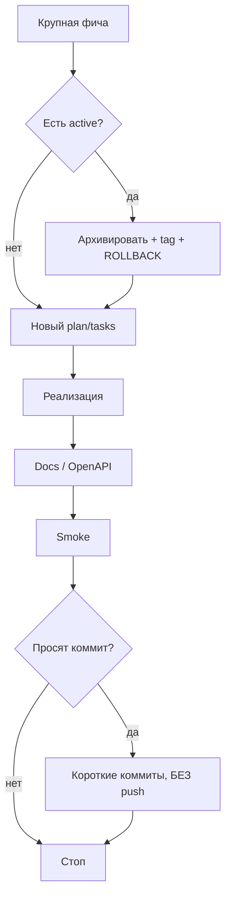

# AGENTS.md — правила работы агента в llm-proxy

Этот файл — каноническая инструкция для AI-агента.  
Перед крупной задачей **прочитай** `AGENTS.md`, `TODO/README.md`, актуальный `TODO/active/*/plan.md`.

Язык общения с пользователем: **русский**, коротко и по делу.

---

## 1. Цель проекта

HTTP-прокси над бесплатными LLM (Gemini, Groq, OpenRouter):

- единый OpenAI-совместимый API;
- прозрачные квоты / remaining;
- модели отсортированы от сильных к слабым;
- статистика в PostgreSQL;
- Swagger на `/docs`;
- документация архитектуры и провайдеров.

Living docs: `README.md`, `docs/architecture.md`, `docs/api.md`, `docs/providers/*`, `api/openapi.yaml`.

---

## 2. Жёсткие правила пользователя

### Git (критично)

- **Никогда не делать `git push`** (и не пушить tags), пока пользователь **явно** не попросил. Пушит только он.
- После коммитов достаточно сказать, что закоммичено локально; **не предлагать push навязчиво**.
- Коммиты — **короткие и лаконичные**:
  - одно логическое изменение ≈ один коммит;
  - сообщение 1 короткая строка (при необходимости ещё одна строка «почему»);
  - не сваливать postgres + ranking + docs в один коммит, если можно разделить.
- Коммитить **только когда пользователь попросил** (или явно «закоммить»).
- Не коммитить секреты: `.env`, ключи, дампы БД.
- Не делать destructive git (`push --force` на main, hard reset) без явной просьбы; если история разошлась — предупредить про `--force-with-lease`.

### Секреты и данные

- Ключи только в `.env` (в `.gitignore`).
- В ответах **не светить** значения API keys.
- Postgres через раздельные env: `DB_HOST`, `DB_PORT`, `DB_USER`, `DB_PASSWORD`, `DB_NAME`, `DB_SSLMODE`.

### Документация обязательна

- Каждый провайдер → `docs/providers/<name>.md`.
- Публичные ручки → `docs/api.md` + `api/openapi.yaml` (`/docs`).
- Алгоритмы → `docs/architecture.md` с Mermaid.
- Сначала читать карточки провайдеров, не искать заново без нужды.

### Код и проверки

- Менять только то, что нужно для задачи.
- После существенных изменений — **smoke-тест** (health, models/chat/stats по ситуации), не заявлять успех вслепую.

### Коммуникация

- Прямо и кратко; длинные отчёты — только если просят.

---

## 3. SDD / TODO workflow

```
TODO/
  active/YYYY-MM-DDTHHMMSS-<slug>/   ← одна крупная фича
    plan.md
    tasks.md
  archive/YYYY-MM-DD-<slug>/         ← иммутабельно
    plan.md
    tasks.md
    ROLLBACK.md                      ← git tag + откат
```

### Старт новой крупной фичи

1. Архивировать текущую `active/` (tasks → tag `archive/YYYY-MM-DD-<slug>` → `ROLLBACK.md` → move в `archive/`).
2. Создать новый `active/.../plan.md` + `tasks.md`.
3. Код → docs/swagger → smoke.
4. Коммиты — по просьбе, **без push**.

Мелкие правки можно без TODO. Крупные — только через TODO.

### Откат

```bash
git tag -l 'archive/*'
git switch -c rollback/<slug> archive/YYYY-MM-DD-<slug>
```

---

## 4. Порядок работы



---

## 5. API (кратко)

| Метод | Путь |
|-------|------|
| GET | `/docs`, `/openapi.yaml`, `/healthz` |
| GET | `/v1/providers`, `/v1/models`, `/v1/stats/summary` |
| POST | `/v1/chat/completions` |

`/v1/models`: `rank=1` — лучшая; есть `quality_score`, `quota`.

Инфра: `docker compose up -d` (web UI + proxy + Postgres + pgAdmin). UI: `:3000`. Раздача: `docs/DEPLOY.md`, скрипты `scripts/start.*`. Ключи: `.env` и/или UI → runtime volume (`RUNTIME_DATA_DIR`), не в образ.

---

## 6. Без явной просьбы не делать

- `git push` / push tags  
- Ломающий API без swagger+docs  
- Новый провайдер без карточки  
- Фичи «заодно» вне plan  
- Коммит `.env`
