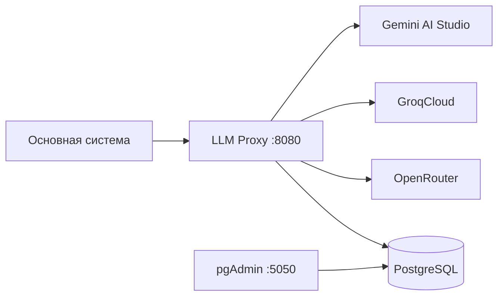
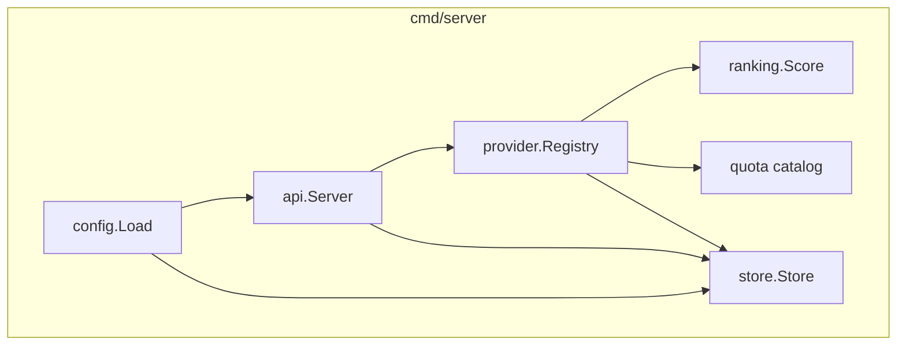
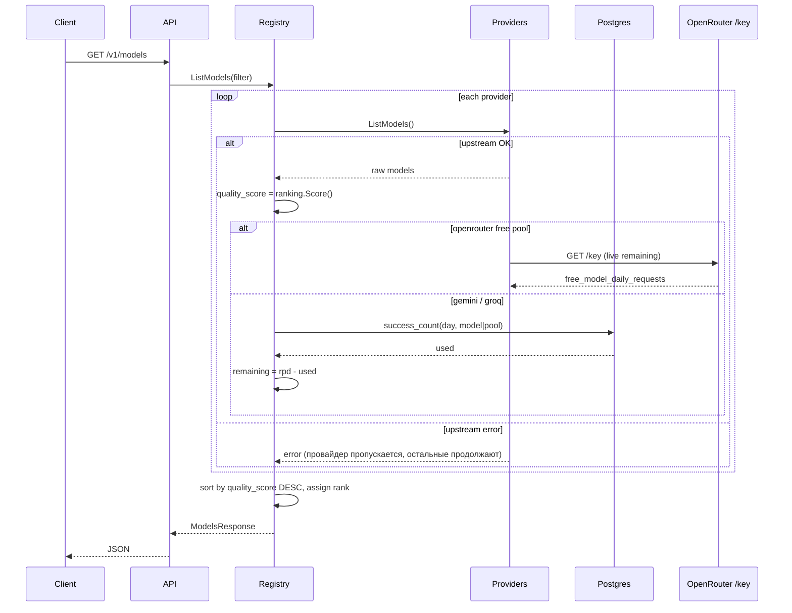
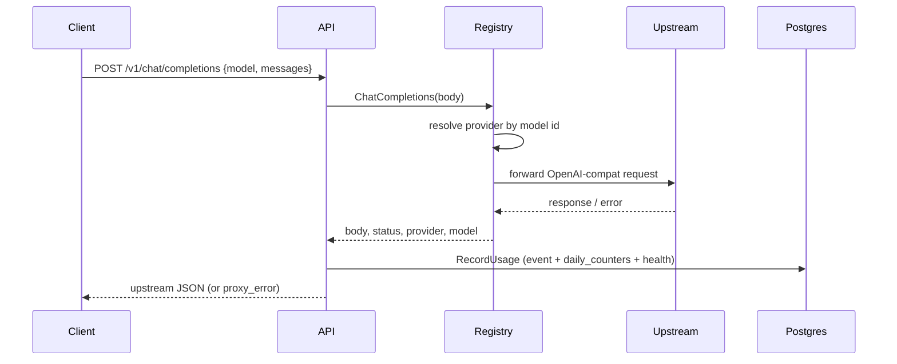
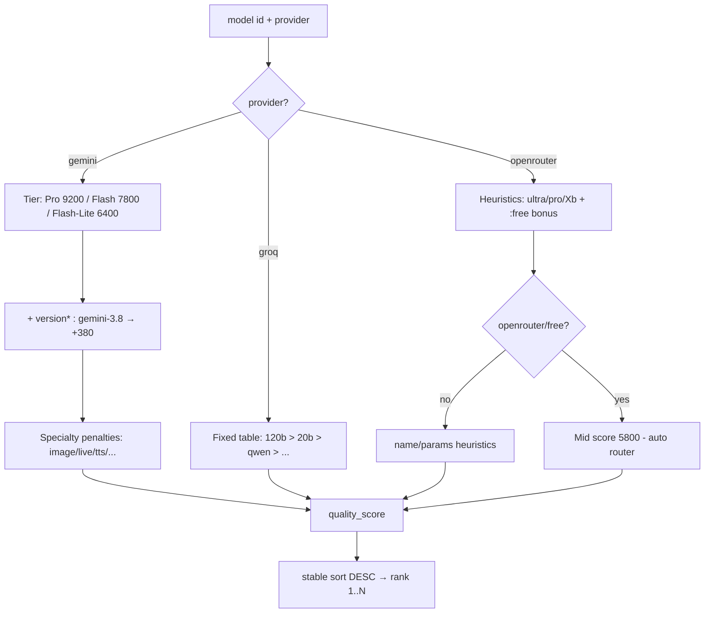
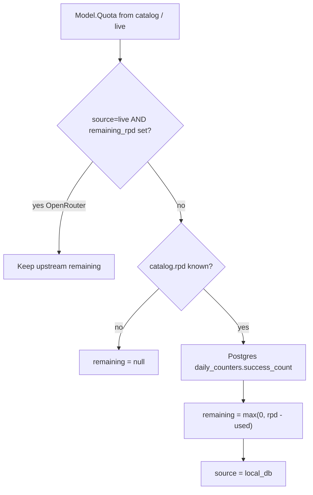
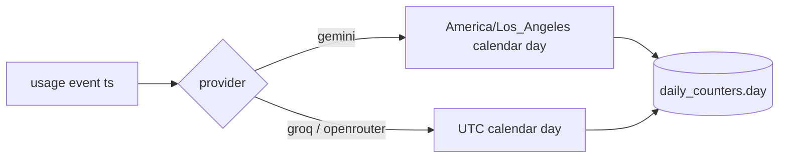
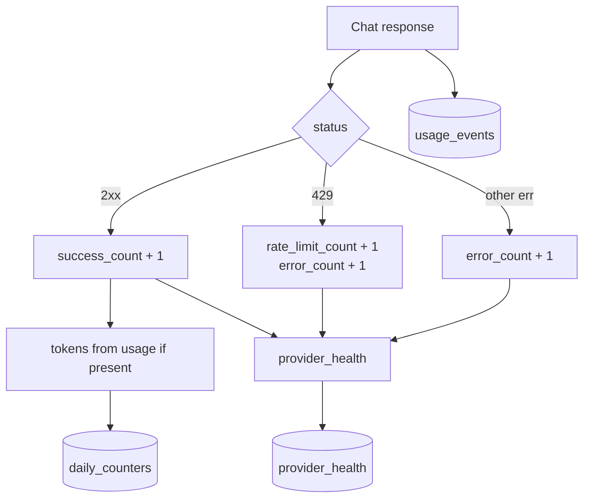
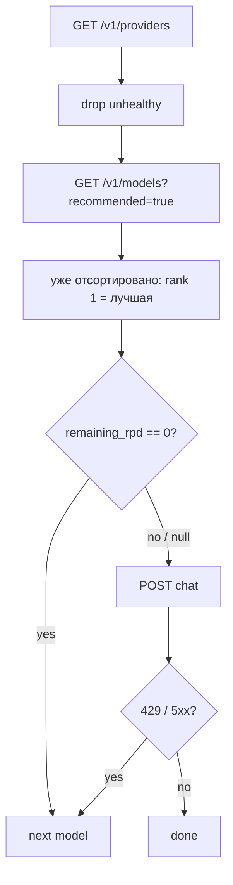
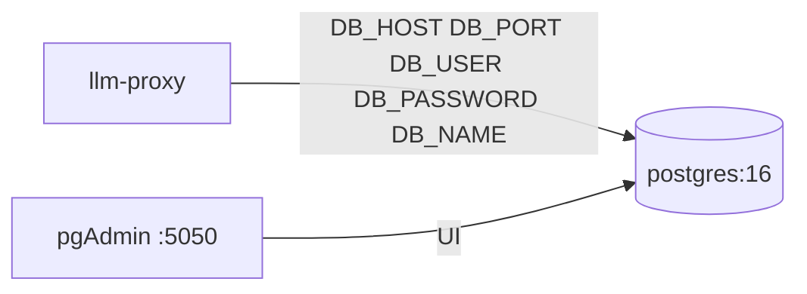

# Архитектура LLM Proxy

Документ описывает, как устроена система: компоненты, потоки данных, квоты, ранжирование моделей и учёт статистики.

Интерактивный API: [/docs](http://localhost:8080/docs) · карточки провайдеров: [`docs/providers/`](./providers/).

## 1. Обзор

Прокси агрегирует бесплатные LLM-источники (Gemini, Groq, OpenRouter) за единым OpenAI-совместимым API. Основная система:

1. смотрит `/v1/providers` и `/v1/models` (уже отсортированы по «мозгам»);
2. выбирает модель с учётом `rank`, `quality_score`, `quota.remaining_rpd`;
3. шлёт `/v1/chat/completions`;
4. при необходимости смотрит `/v1/stats/summary`.



## 2. Компоненты

| Компонент | Путь / сервис | Роль |
|-----------|---------------|------|
| HTTP API | `internal/api` | ручки, Swagger, запись usage |
| Registry | `internal/provider` | агрегация моделей, роутинг chat по `model` |
| Providers | `internal/provider/{gemini,groq,openrouter}` | upstream OpenAI-compat клиенты |
| Quota catalog | `internal/quota` | статические лимиты Free Tier |
| Ranking | `internal/ranking` | `quality_score` (выше = умнее) |
| Store | `internal/store` | PostgreSQL: events, counters, health |
| Postgres | `docker-compose` service `postgres` | persistence |
| pgAdmin | `docker-compose` service `pgadmin` | UI БД |



## 3. Data flow: list models



## 4. Data flow: chat completions



## 5. Алгоритм ранжирования моделей

Цель: в `/v1/models` первыми идут **более сильные** chat-модели, specialty (TTS/STT/image/guard) — ниже.

Реализация: `internal/ranking.Score(provider, modelID) → int`.



### Принципы по источникам (на основе docs провайдеров)

| Источник | Приоритет «мозгов» |
|----------|-------------------|
| Gemini | Pro ≫ Flash ≫ Flash-Lite; новее major/minor выше; `*-latest` чуть ниже явной версии |
| Groq Free | `gpt-oss-120b` > `gpt-oss-20b` ≈ `qwen3.8-27b` ≫ safeguard / whisper / orpheus / prompt-guard |
| OpenRouter free | крупные / reasoning / pro выше mini-lite; `openrouter/free` — удобный mid-priority fallback |

Поля ответа:

- `quality_score` — сырой score
- `rank` — позиция после сортировки (`1` = лучшая в выдаче)

Рекомендация основной системе: брать первый элемент с `remaining_rpd > 0` (или `null` remaining + healthy provider).

## 6. Алгоритм квот и remaining



| Поле | Смысл |
|------|--------|
| `scope=per_model` | свой счётчик на `(day, provider, model)` |
| `scope=shared_pool` + `pool_id` | общий бюджет (все OpenRouter free → `openrouter:free`) |
| `reset_rpd_hint` | `midnight_pacific` (Gemini), `midnight_utc` (OpenRouter), `sliding_window` (Groq docs) |
| `confidence` | `exact` / `estimate` / `unknown` |

### Дневной bucket



> Groq на upstream использует sliding windows; локальный RPD-счётчик — **аппроксимация** для роутера. OpenRouter live remaining — источник истины для free pool.

## 7. Алгоритм учёта usage / статистики

При каждом chat (успех или ошибка):

1. `INSERT usage_events` — append-only лог
2. `UPSERT daily_counters` — инкремент success/error/rate_limit + tokens
3. `UPSERT provider_health` — last success/error, consecutive_errors



`GET /v1/stats/summary` агрегирует counters за `[from, to]` (по умолчанию 7 дней UTC).

## 8. Рекомендуемый роутинг основной системы



Важно: для `pool_id=openrouter:free` не суммируй RPD по моделям — это **один** бюджет.

## 9. Инфраструктура данных



Запуск:

```bash
docker compose up -d
# pgAdmin: http://localhost:5050
#   login: admin@llm-proxy.local / admin
#   добавить server Host=postgres User=llmproxy Password=llmproxy DB=llmproxy
```

Таблицы: см. `internal/store` migrate SQL.

## 10. Конфигурация

| Env | Default |
|-----|---------|
| `DB_HOST` | `localhost` |
| `DB_PORT` | `5432` |
| `DB_USER` | `llmproxy` |
| `DB_PASSWORD` | `llmproxy` |
| `DB_NAME` | `llmproxy` |
| `DB_SSLMODE` | `disable` |
| `ADDR` | `:8080` |
| `GEMINI_API_KEY` / `GROQ_API_KEY` / `OPENROUTER_API_KEY` | — |

DSN для pgx собирается в `config.Load()` из `DB_*`. См. `.env.example`.
